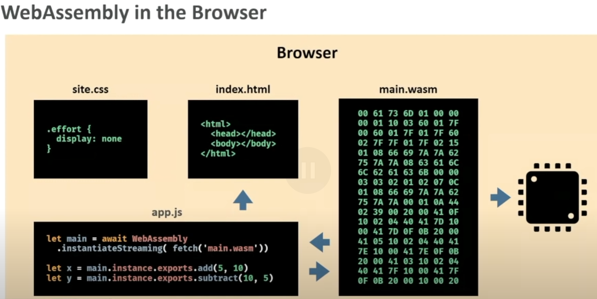

### some abbreviations:

dapp: decentralized application (can be full-stack)  
IC: internet computer  
dfx: developer experience, the IC-SDK 的 CLI  
Candid: 多个不同语言写的 canister 之间的 RPC 通信语言;an interface description language (IDL),a tool developed by DFINITY that allows different programs to communicate with each other on the Internet Computer.(Candid” does not appear to be an acronym or abbreviation, hah)  
CDK:Canister Development Kit ,主要是各个语言提供的操作 canister 的库,可以包含在 IC-SDK 里面,如 rust-CDK,python-CDK,typescript-CDK  

#### some interesting fact:

HCI: human–computer interaction  
GUI: colorful ,with buttons and images,  
CLI: only text input and ouput  
normally call GUI as frontend.  
but Graphical User Interface by its\` name is not quite accurate diff with CLI. CLI could also be a kind of Graphical User Interface,use text to represent pictures,hah.  

```
  (\(\
  ( -.-)
  o_(")(")

```

In theory, any language that can be compiled into a WebAssembly module, can produce modules tailored for the IC deployable as an ICP smart contract.  

# dfx intro

## install dfx

```sh
sh -ci "$(curl -fsSL https://internetcomputer.org/install.sh)"
# or:(if encounter net problem)
wget https://github.com/dfinity/sdk/releases/download/0.14.3/dfx-0.14.3-x86_64-linux.tar.gz

# mention the dfx version,maybe you should use latest.
# v0.14.3 just for 2023-7


```

## IC-canister running tutorial:

```sh
dfx new hello # create a example project "hello"
cd hello
dfx start --background

# deploy:
npm install # install all dependencies locally
dfx deploy #start backend and frontend program

#testing:
dfx canister call hello_backend greet everyone
# greet -> backend_controller_name
# everyone -> the param to send with that controller(function on the server)
# receive from the terminal output:
# ("Hello, everyone!")

#stop:
dfx stop
```

replica 原意副本,在这里 dfx 里面特指 Internet Computer local network binary  
这是啥? 本地链? 还是一个 http 服务器?  

## How to use other backend language ?

By default backend use Mokoto.  
How to use rust (with webMVC) ?  
Or even Java , Python?  
todo  
Some IC-rust maybe:
https://github.com/usergeek/canistergeek_ic_rust  
IC-app-flutter:
https://github.com/AstroxNetwork/agent_dart  

## Deploy dapp on IC-chain(on the Internet)

todo  

### use IC-chain need resource

需要 nodes:由物理机(CPU,RAM,Storage),和网络,电力的计算节点  
所以需要钱: 用 IC 的 cryptcurrncy 来换取成另一种币:他们称为 Cycle,然后你有一个 Cycle wallet,用来支付运行 canister 的费用  
USD >> IC-cryptoconcurrency >> cycle >> run canister  
另外 IC 会免费送点 cycles 第一次使用的时候:  
https://internetcomputer.org/docs/current/developer-docs/setup/cycles/cycles-faucet  

## IC compile all codes into WASM

# WebAssembly intro:

content from: https://youtu.be/3sU557ZKjUs  
WASM:
1.assembly language for web browser  
  
2.A solution to a problem:
problem is JS:
JS running on browser steps:
  
带来的问题就是运行速度太慢,总是需要现场编译 js 文件  

wasm 是一个运行在 browser 里面的 VM  
这个 VM 运行 bytecode(vm-assembly)  

利用这个特性,可以编译任何语言为 assembly!  

原生的 asm 代码是 architecture-specific  
因此 computer scientist 发明了 virtual-processor  
分离了原生 asm 和 phsical-processor  
最终使得 v-asm 可以运行于任何的 cpu 上面!  
  
  
这里是一个.wasm 文件,包含了一堆可以拿来用的函数  
有点像.dll 文件  
  
  

.wat 文件是对应像.S (汇编代码) 文件,有助记符,text format of WebAssembly  
.wasm 则是纯二进制直接可以运行在 VM 上面的文件,可以用 hexdump 来简单查看.  
使用 wat2wasm 则转译,作用像是 as 汇编器  
使用 wasmtime 可以在命令行运行 wasm 文件,像是 js 的 runtime:如 nodejs  
WASI:WebAssembly System Interface, 提供系统级别的 IO  

#### 编译过程:

c++/rust 高级语言代码 -> .wat 汇编文件 -> wasm 二进制文件  
对比理解:
  

# IC-SDK-APIs of Rust

## queries:

对于普通信息:如博客,问答,可以在链上传输  
例子:
if you are developing a blogging platform, queries that retrieve articles matching a tag probably don’t warrant going through consensus(共识) to ensure that a majority of nodes agree on the results.意思是?可能各个链上数据不是完全同步的?  
这里的共识关系到 block-chain 的共识算法嘛?还是什么意思?  

对于敏感信息,如账单交易,需要做**certified queries**,enable you to receive **authenticated responses**.  

基于区块链,所有的 DB 数据都是存在链上的吗?  
canister 只是在负责做函数计算吗?  

## queries 的数据来源:Data Storage

query 查询的是 IC 特别命名的 stable memory,这里的 memory 不是指普遍意义 CS 中的内存条,😅  
但是反正可以抽象为:
**一个稳定存储的 byte 数组,任何 canister 都可以来 CRUD**,  
怎么实现的目前不了解,用就完事儿了.  
可能是存在链上的.  

#### 一些最大存储限制

如单词网络发送容量,链上存储容量,RPC 交互节点量,wasm 最大文件大小等:https://internetcomputer.org/docs/current/developer-docs/backend/resource-limits  

## IC-SDK-Rust

ref: https://github.com/dfinity/cdk-rs  

intro:
A canister is a WebAssembly (wasm) module that can run on the Internet Computer.  
